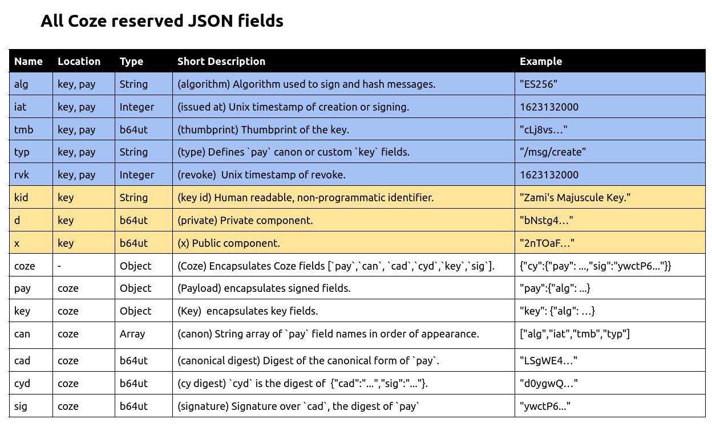
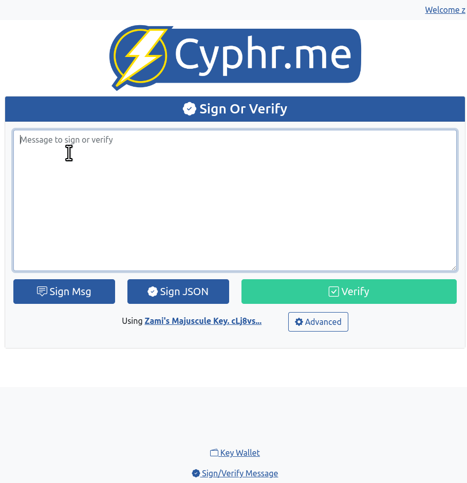

# ⚠️ COZE IS IN ALPHA.  USE AT YOUR OWN RISK ⚠️
[](https://pkg.go.dev/github.com/cyphrme/coze)


[Presentation](https://docs.google.com/presentation/d/1bVojfkDs7K9hRwjr8zMW-AoHv5yAZjKL9Z3Bicz5Too)

# Coze 
**Coze** is a cryptographic JSON messaging specification designed for human
readability.

[Try Coze out!](https://cyphr.me/coze_verifier)

### Example Coze
```JSON
{
	"pay": {
		"msg": "Coze Rocks",
		"alg": "ES256",
		"iat": 1623132000,
		"tmb": "cLj8vsYtMBwYkzoFVZHBZo6SNL8wSdCIjCKAwXNuhOk",
		"typ": "cyphr.me/msg"
	},
	"sig": "Jl8Kt4nznAf0LGgO5yn_9HkGdY3ulvjg-NyRGzlmJzhncbTkFFn9jrwIwGoRAQYhjc88wmwFNH5u_rO56USo_w"
}
```

### Coze Design Goals
1. Valid and idiomatic JSON. 
2. Human readable and writable.
3. Small in scope.
4. Cryptographic agility.

### Coze Fields
Coze objects encapsulate a set of JSON name/value fields.  Coze JSON objects are
case sensitive, must be valid JSON, and must contain unique field names. Coze
**reserved fields** must be used according to Coze.  Applications are permitted
to use additional fields as desired.  All reserved fields are optional, but
omitting standard fields may limit compatibility among Coze supporting
applications.  Binary values are encoded as RFC 4648 base64 URI with padding
omitted.  The Coze objects `pay`, `key`, and `coze` have respective reserved
fields.

#### All Coze Reserved Field Names



## Pay
`pay` may contain the standard fields `alg`, `iat`, `tmb`, and `typ` and
additional fields.  In the first example, `msg` is additional.

### `pay` Reserved Names
- `alg` - Specific cryptographic algorithm.  E.g. `"ES256"`
- `iat` - The time when the message was signed. E.g. `1623132000`
- `tmb` - Thumbprint of the key used to sign the message.  E.g. `"cLj8vs..."`
- `typ` - Type of `pay`.

`typ`'s value may be used by applications as desired.  The value is recommended
to denote API information such as versioning, expected fields, and/or other
application defined programmatic functions.  In the first example,
`"typ":"cyphr.me/msg"` denotes a `pay` with the fields
`["msg","alg","iat","tmb","typ"]` as defined by a hypothetical application.  


## Coze Key
### Example Public Coze Key
```JSON
{
	"alg":"ES256",
	"iat":1623132000,
	"kid":"Zami's Majuscule Key.",
	"tmb":"cLj8vsYtMBwYkzoFVZHBZo6SNL8wSdCIjCKAwXNuhOk",
	"x":"2nTOaFVm2QLxmUO_SjgyscVHBtvHEfo2rq65MvgNRjORojq39Haq9rXNxvXxwba_Xj0F5vZibJR3isBdOWbo5g"
}
```

### Example Private Coze Key
```JSON
{
	"alg":"ES256",
	"iat":1623132000,
	"kid":"Zami's Majuscule Key.",
	"d":"bNstg4_H3m3SlROufwRSEgibLrBuRq9114OvdapcpVA",
	"tmb":"cLj8vsYtMBwYkzoFVZHBZo6SNL8wSdCIjCKAwXNuhOk",
	"x":"2nTOaFVm2QLxmUO_SjgyscVHBtvHEfo2rq65MvgNRjORojq39Haq9rXNxvXxwba_Xj0F5vZibJR3isBdOWbo5g"
}
```

### `key` Reserved Names
- `key` - Key object.  E.g. `"key":{"alg":"ES256", ...}`
- `alg` - Algorithm.  E.g. `"ES256"`
- `d`   - Private component.  E.g. `"bNstg4..."`
- `iat` - "Issued at", When the key was created.  E.g. `1623132000`
- `kid` - "Key identifier", Human readable, non-programmatic label.  E.g. `"kid":"My Cyphr.me Key"`. 
- `tmb` - Thumbprint.  E.g. `"cLj8vs..."`
- `x`   - Public component.  E.g. `"2nTOaF..."`.
- `typ` - "Type", Additional application information.  E.g. `"cyphr.me/msg"`
- `rvk` - "Revoke", time of key revocation.  See the `rvk` section.  E.g. `1623132000`

Note that the private component `d` is not included in `tmb` generation.   Also
note that `kid` must not be used programmatically while `typ` may be used
programmatically. 


## Coze object
The JSON name `coze` may be used to wrap Coze objects.  For example:

```JSON
{
	"coze":{
		"pay": {
			"msg": "Coze Rocks",
			"alg": "ES256",
			"iat": 1623132000,
			"tmb": "cLj8vsYtMBwYkzoFVZHBZo6SNL8wSdCIjCKAwXNuhOk",
			"typ": "cyphr.me/msg"
		},
		"sig": "Jl8Kt4nznAf0LGgO5yn_9HkGdY3ulvjg-NyRGzlmJzhncbTkFFn9jrwIwGoRAQYhjc88wmwFNH5u_rO56USo_w"
	}
}
```

### `coze` Reserved Names
- `coze` - JSON name for Coze objects.  E.g. `{"coze":{"pay":..., sig:...}}`
- `can` - "Canon" of `pay`.  E.g. `["alg","iat","tmb","typ"]`
- `cad` - "Canon digest", the digest of `pay`.  E.g.: `"LSgWE4v..."`
- `czd` - "Coze digest", the digest over `["cad","sig"]`.  E.g. `d0ygwQ...`
- `pay` - Label for the pay object.  E.g. `"pay":{"alg":...}`
- `sig` - Signature over `cad`.  E.g. `"sig":"ywctP6..."`

`sig` is the signature of the bytes represented by `cad` and `cad` is not
rehashed before signing. `czd`'s hashing algorithm must align with `alg` in
`pay`.  `czd` refers to a particular signed message. Like `cad`, `czd` is
calculated from brace to brace, including the braces. `cad` and `czd` are
recalculatable and are recommended to be omitted, although they may be useful
for reference.  

### Verbose `coze`
Needlessly wrapping Coze objects or including unneeded labels is not
recommended. For example, the JSON object `{"pay":{...},"sig":...}` doesn't need
the labeled `coze` if implicitly known by applications.

The following adds to the previous example the fields `key`, `can`, `cad`, and
`czd` that should generally be omitted unless needed by applications. `key` may
be looked up by applications by using `tmb`, `can`, `cad`, and `czd` are
recalculatable, and the label `coze` may be inferred.  

A tautological coze:

```JSON
{
	"coze": {
		"pay": {
			"msg": "Coze Rocks",
			"alg": "ES256",
			"iat": 1623132000,
			"tmb": "cLj8vsYtMBwYkzoFVZHBZo6SNL8wSdCIjCKAwXNuhOk",
			"typ": "cyphr.me/msg"
		},
		"key": {
			"alg":"ES256",
			"iat":1623132000,
			"kid":"Zami's Majuscule Key.",
			"tmb":"cLj8vsYtMBwYkzoFVZHBZo6SNL8wSdCIjCKAwXNuhOk",
			"x":"2nTOaFVm2QLxmUO_SjgyscVHBtvHEfo2rq65MvgNRjORojq39Haq9rXNxvXxwba_Xj0F5vZibJR3isBdOWbo5g"
		},
		"can": ["alg","iat","msg","tmb","typ"],
		"cad": "Ie3xL77AsiCcb4r0pbnZJqMcfSBqg5Lk0npNJyJ9BC4",
		"czd": "TnRe4DRuGJlw280u3pGhMDOIYM7ii7J8_PhNuSScsIU",
		"sig": "Jl8Kt4nznAf0LGgO5yn_9HkGdY3ulvjg-NyRGzlmJzhncbTkFFn9jrwIwGoRAQYhjc88wmwFNH5u_rO56USo_w"
	}
}
```

Simplified:

```JSON
{
	"pay": {
		"msg": "Coze Rocks",
		"alg": "ES256",
		"iat": 1623132000,
		"tmb": "cLj8vsYtMBwYkzoFVZHBZo6SNL8wSdCIjCKAwXNuhOk",
		"typ": "cyphr.me/msg"
	},
	"sig": "Jl8Kt4nznAf0LGgO5yn_9HkGdY3ulvjg-NyRGzlmJzhncbTkFFn9jrwIwGoRAQYhjc88wmwFNH5u_rO56USo_w"
}
```


## Canon
A **canon** is a list of fields used for normalization, e.g. `["alg","x"]`. Coze
objects are canonicalized for creating digests, signing, verification, and
reference. The canon of `pay` is the currently present fields. The following
Coze fields have predefined canons:  
- `cad`'s canon is `pay`'s fields in order of appearance.
- `tmb`'s canon is `["alg","x"]`.
- `czd`'s canon is `["cad","sig"]`.

Using a canon, the **canonical form** of an object is generated by removing
fields not appearing in the canon, ordering remaining fields by appearance in
the canon, and eliding unnecessary whitespace.  Note that's since `pay`'s canon
is the present fields, no fields are removed when canonicalizing `pay`.  

Generation steps for the canonical form:
 0. Omit fields not present in canon.
 1. Order fields by canon.
 2. Omit insignificant whitespace.

A **canonical digest** is generated by hashing the canonical form using the
hashing algorithm specified by `alg`.  For example,`"ES256"`'s hashing algorithm
is `"SHA-256"`.

The key thumbprint, `tmb`, is the canonical digest of `key` using the canon
`["alg","x"]` and hashing algorithm specified by `key.alg`.  For example, a key
`alg` of `ES256` corresponds to the hashing algorithm `SHA-256`. The canonical
form of the example key is:

```JSON
{"alg":"ES256","x":"2nTOaFVm2QLxmUO_SjgyscVHBtvHEfo2rq65MvgNRjORojq39Haq9rXNxvXxwba_Xj0F5vZibJR3isBdOWbo5g"}
```

Hashing this canonical form results in the following digest, which is `tmb`:
`cLj8vsYtMBwYkzoFVZHBZo6SNL8wSdCIjCKAwXNuhOk`. 

`czd` is the canonical digest of `coze` with the canon `["cad","sig"]`, which
results in the JSON `{"cad":"...",sig:"..."}`.  `czd`'s hash must align with
`alg` in `pay`. 

The canonical digest of 
 - `key` is `tmb`, 
 - `pay` is `cad`, 
 - `["cad","sig"]` is `czd`.

Using the first example, the following canonical digests are calculated:
- `tmb` is `cLj8vsYtMBwYkzoFVZHBZo6SNL8wSdCIjCKAwXNuhOk`
- `cad` is `LSgWE4vEfyxJZUTFaRaB2JdEclORdZcm4UVH9D8vVto`.
- `czd` is `d0ygwQCGzuxqgUq1KsuAtJ8IBu0mkgAcKpUJzuX075M`.

Calls verification functions must ignore `can` if present.  Any mutation of
`pay` via `can` must occur before verification.  

### Coze and Binaries
The canonical digest of a binary file may simply be the digest of the file. The
hashing algorithm and any other metadata may be denoted by an accompanying coze.
For example, an image ("coze_logo_icon_256.png") may be referred to by its
digest. 

```JSON
{
	"alg":"SHA-256",
	"file_name":"coze_logo_icon_256.png",
	"id":"oDBDAg4xplHQby6iQ2lZMS1Jz4Op0bNoD5LK3KxEUZo"
}
```

For example, a file's digest, denoted by `id`, may represent the authorization
to upload a file to a user's account.

```JSON
{
 "pay": {
  "alg": "ES256",
  "file_name": "coze_logo_icon_256.png",
  "id": "oDBDAg4xplHQby6iQ2lZMS1Jz4Op0bNoD5LK3KxEUZo",
  "iat": 1623132000,
  "tmb": "cLj8vsYtMBwYkzoFVZHBZo6SNL8wSdCIjCKAwXNuhOk",
  "typ": "cyphr.me/file/create"
 },
 "sig": "DgJb6Qb81uhC-ulZJlIIj8ahi0b5rAbtnkQhiEH1FB0HeNiACVh_Deo6a22OkK2tr0UcDOiIRY1X-BUriw03Mg"
}
```


## Revoke
A Coze key may be revoked by signing a self-revoke coze.  A self-revoke coze has
the field `rvk` an integer value other than `0`.  For example, the integer value
`1` is suitable to denote revocation.  A Unix timestamp of the time of
revocation is the suggested value for `rvk`.

### Example Self Revoke
```JSON
{
 "pay": {
  "alg": "ES256",
  "iat": 1623132000,
  "msg": "Posted my private key online",
  "rvk": 1623132000,
  "tmb": "cLj8vsYtMBwYkzoFVZHBZo6SNL8wSdCIjCKAwXNuhOk",
  "typ": "cyphr.me/key/revoke"
 },
 "sig": "KVjPjMVHoL828WyAH5biqIOt-IOaQ5EBtN_7eQifP2w3agUHu6KfqO40_oqQ5GE_BShgXvhbK0O6Z2h5YPNAcw"
}
```

- `rvk` - Unix timestamp of when the key was revoked.  

Coze explicitly defines a self-revoke method so that third parties may revoke
leaked keys. Systems storing Coze keys should provide an interface permitting a
given Coze key to be mark as revoked by receiving a self-revoke message.
Self-revokes with future times must immediately be considered as revoked.  Coze
requires `rvk` to be an integer with a maximum value of 9,007,199,254,740,991
(2^53 – 1), which is Javascript's `MAX_SAFE_INTEGER`. Checking for revoked when
 `rvk`'s value is a non-integer or value past MAX_SAFE_INTEGER must error.  

Key expiration policies, key rotation, and alternative revocation methods are
outside the scope of Coze.


## Alg
`alg` specifies a parameter set and is a single source of truth for Coze
cryptographic operations. 

### Example - "alg":"ES256"
- Name:         ES256
- Genus:        ECDSA
- Family:       EC
- Use:          sig
- Hash:         SHA-256
- HashSize:     32 
- HashSizeB64:  43
- XSize:        64
- XSize64:      86
- DSize:        32
- DSize64:      43
- Curve:        P-256
- SigSize:      64
- SigSize64:    86

### Supported Algorithms 
- ES224
- ES256
- ES384
- ES512
- Ed25519 
- Ed25519ph (planned)


## Coze Verifier
Cyphr.me provides an online tool for signing and verifying Coze messages and
plans to release an open source, stand alone version of the webpage.  

Play with Coze here: https://cyphr.me/coze_verifier.




## Standard Coze
The sections above are defined as "Core Coze".  Further expansions on Coze may
be included in "Coze Standard".  Further draft, proposals, and extended
algorithm support are planned in "Coze Experimental".

See `normal.go` for an example of a Coze Standard feature not included in Core
Coze.  


## Coze Implementations
 - [Go Coze (this repo)](https://github.com/Cyphrme/coze)
 - [Coze js (Javascript)](https://github.com/Cyphrme/cozejs)

See `docs/developement.md` for the Go development guide.


# FAQ

#### Pronunciation? What does "Coze" mean? 
We say "Co-zee" like a comfy cozy couch.  The English word Coze is pronounced
"kohz" and means "a friendly talk; a chat" which is the perfect name for a
messaging standard.

Jared suggested Coze because it looks like JOSE or COSE but it's funnier.

#### "Coze" vs "coze"?
We use upper case "Coze" to refer to the specification, and "coze" to refer to
coze messages and objects.

#### Why release pre-alpha on 2021/06/08?
Coze was released on 2021/06/08 (1623132000) since it's 30 years and one day
after the initial release of PGP 1.0.

#### Required Coze Fields 
Coze has no required fields.  If an application uses Coze while omitting
standard fields, it may result in incompatibility, so it is suggested to always
include standard fields appropriately.   

For the `key` object it is suggested that public keys always have `alg`, `iat`
`kid`, `tmb` and `x` and additionally for private keys the field `d`.

#### The Empty Coze
An empty `pay` is legitimate and may be verified if `alg` and `tmb` are
implicitly known. The following, an example of an "empty coze", is valid and was
signed with the key "cLj8vs ..." which has the `alg` "ES256". The objects `pay`
and `coze` have no required fields, but without the standard fields cozies will
be less useful to third parties.    

```json
{
	"pay":{},
	"sig":"9iesKUSV7L1-xz5yd3A94vCkKLmdOAnrcPXTU3_qeKSuk4RMG7Qz0KyubpATy0XA_fXrcdaxJTvXg6saaQQcVQ"
}
```

#### ASCII/Unicode/UTF-8/UTF-16 and Ordering?
Although JSON was designed in a Javascript (UTF-16) context, the latest JSON RFC
requires UTF-8 encoding, a decision that was made because all significant
existing implementations used UTF-8.  Unicode is a superset of ASCII and UTF-8
shares sorting order with Unicode. This results in broad, out of the box
compatibility. Object field order may be denoted by a canon, chaining normal, or
communicate ordering via other means.  If applications need sorted fields, UTF-8
order should be used.  

Note that UTF-16 (Javascript) has some code points out of order. For these
systems, a small amount of additional logic is needed to correct the sort order.

#### Binary? Why not support binary payloads like JOSE?
JSON isn't well designed for large binary payloads.  Instead, Coze suggests
including the short binary file's digest in a coze message while transporting
the binary seperately. See the binary example above.  

There's nothing stopping an application from base64 encoding a binary for
transporting, although it's not recommended.

#### Why is Coze's scope so limited?
Coze is intentionally scope limited.  It is easier to extend a limited standard
than to fix a large standard. Coze can be extended and customized for individual
applications. 

#### Is Coze versioned?
`alg` refers to a specific set of parameters for all operations.  If an
operation needs a different parameter set, `alg` itself must denote the
difference.

Implementation releases themselves are versioned. The hope for the specification
"Coze Core" stays simple and stable enough to preclude versioning. Instead, Coze
Core "versioning" will be accomplished by noting specific algorithm support.
Versioning by feature permits Coze implementations to support a subset of
features while remaining Coze compliant.  In this way libraries may remain
spartan and avoid feature bloat. Further expansions on Coze may be included in
"Coze Standard". Further draft, proposals, and extended algorithm support are
planned in "Coze Experimental".

#### How can my API do versioning?
API versioning may be handled in an application however desired.  A suggested
way of incorporating API versioning in Coze is to use `typ`,
e.g. `cyphr.me/v1/msg/create`, where v1 is the api version.

#### Why does `pay` have cryptographic components?
Coze's `pay` includes all payload information, a design we've dubbed a "fat
payload".  We consider single pass hashing critical for Coze's simple design.

Alternative schemes require a larger canon, `{"head":{...},"pay":{...}}`, or
concatenation like `digest(head) || digest(pay)`.  By hashing only `pay`, the
"head" label and encapsulating parenthathese are dropped, `pay:{...}`, and the
label `"pay"` may then be inferred, `{...}`.  `{...}` is better than
`{"head":{...},"pay":{...}}`.  

Verifying a coze already requires hashing `pay`.  Parsing `alg` from `pay` is a
small additional cost.  

#### Can my application use Canon/Canonicalization?
Canon may be implicitly known by applications, implicitly derived by "typ", or
explicitly specified by `can`. Applications may specify canon expectations in
API documentation.  If a message is malformed, applications must error. 

Applications may find it useful to have messages in a specific normalized form.
Core Coze has canonicalization features, or for more expressive capabilities,
see Normal in Coze Standard.  

#### `key.typ` vs `pay.typ`. 
For `pay`, `typ` may be used to denote a canon.  For example, a `typ` with value
`cyphr.me/create/msg` has a canon of ["alg", "iat", "msg", "tmb", "typ"], as
defined by the service.  For `key`'s canonical form, `typ` is ignored and a
static canon is used. Like `typ` in `pay`, `typ` in `key` may be used to specify
custom application fields, e.g. "first_seen" or "account_id". 

#### ECDSA `x` and `sig` Bytes
For ECDSA , (X and Y) and (R and S) are concatenated for `x` and `sig`
respectively.  For ES512, which unlike the other ECDSA algorithms uses the odd
numbered P-521, X, Y, R, and S are padded before concatenation.  

#### Javascript vs Go crypto.
Javascript's `SubtleCrypto.sign(algorithm, key, data)` always hashes a message
before signing while Go's ECDSA expects a digest to sign. This means that in
Javascript messages must be passed for signing, while in Go only a digest is
needed.  

#### Why not PGP/OpenSSL/LibreSSL/libsodium/JOSE/COSE/etc...?
We have a lot of respect for existing projects. They're great at what they do.
Existing solutions were not meeting our particular needs. Coze is influenced
by many ideas and standards.  
 
See the `coze_vs.md` document for more. 

#### Is `x` derived from `d`?
Yes.  Coze assumes that `x` must be derived from `d`.  

#### Does Coze have checksums?
`x`, `tmb`,`cad`, `czd`, and `sig` may be used for integrity checking. For
messages, `cad`, and/or `czd` may be recalculated and error on mismatch.
Alternatively, systems may use `sig` as an integrity check via cryptographic
verification.  For keys, `x` and/or `tmb` may be recalculated and error on
mismatch.

The only circumstance a Coze key field cannot be integrity checked is when `d`,
`x`, or `tmb` are presented alone.  In situations needing integrity checking, we
recommend including at least two components.

#### Performance hacks?
Coze is not optimized for long messages, but if early knowledge of Coze standard
fields is critical for application performance, put the Coze standard fields
first, e.g. `{"alg", "tmb", ...}`

#### I need to keep my JSON separate but inside a coze.  
If appending custom fields after the standard Coze fields isn't sufficient, we
suggest encapsulating custom JSON in "~", the last ASCII character.  We've
dubbed this a "tilde encapsulated payload". For example: 

```json
{
	"alg": "ES256",
	"iat": 1623132000,
	"tmb": "cLj8vsYtMBwYkzoFVZHBZo6SNL8wSdCIjCKAwXNuhOk",
	"typ": "cyphr.me/msg/create",
	"~": {
		"msg": "tilde encapsulated payload"
	}
}
```

#### Where does the cryptography come from?
Much of this comes from NIST FIPS (See https://csrc.nist.gov/publications/fips)

For example, FIPS PUB 186-3 defines P-224, P-256, P-384, and P-521.


#### Unsupported Things?
The following are out of scope or redundant.  

- `ES192`, `P-192` - Not implemented anywhere and dropped from later FIPS.
- `SHA1`, `MD5` - Not considered secure for a long time.
- `kty` - "Key type". Redundant by `alg`. 
- `iss` - `tmb` fulfills this role.  Systems that need something like an issuer,
associating messages with people/systems, can look up "issuer" based on
thumbprint.  Associating thumbprints to issuers is the design we recommend.  
- `exp` - "Expiration". Outside the scope of Coze.  
- `nbf` - "Not before". Outside the scope of Coze.  
- `aud` - "Audience". Outside the scope of Coze, but consider denoting this with
  'typ'.
- `sub` - "Subject". Outside the scope of Coze, but consider denoting this with
  'typ'.
- `jti` - "Token ID/JWT ID". Redundant by `czd`, `cad`, or an application
  specified field.


#### Encryption?
Coze does not currently support encryption.  If or when it ever does it would be
similar to or simply complement [age](https://github.com/FiloSottile/age).

#### Cryptographic Agility?
>The moral is the need for cryptographic agility. It’s not enough to implement a
single standard; it’s vital that our systems be able to easily swap in new
algorithms when required. We’ve learned the hard way how algorithms can get so
entrenched in systems that it can take many years to update them: in the
transition from DES to AES, and the transition from MD4 and MD5 to SHA, SHA-1,
and then SHA-3.

-- [Bruce Schneier](https://www.schneier.com/blog/archives/2022/08/nists-post-quantum-cryptography-standards.html)

System that are cryptographically agile must not be overly coupled to a single
primitive.  Coze itself is cryptographically agile as its design is generalized
and not overly coupled to any single primitive.  Coze enables other applications
to be cryptographic agile by making cryptographic primitive switching easy. Note
that using a single primitive is perfectly fine for cryptographic agility, but
hard coding systems to use only one primitive is not.  Simultaneous support for
multiple primitives is a secondary perk.

#### JSON "Name", "Key", "Field Name", "Member Name"?
They're all synonyms.  A JSON name is a JSON key is a JSON field name is a JSON
member name.  In this document we use "field name" to avoid confusion with Coze
key.

#### Why are duplicate field names prohibited?
Coze explicitly requires that implementations disallow duplicate field names in
`coze`, `pay`, and `key`.  Existing JSON implementations have varying behavior.  
Douglas Crockford, JSON's inventor, [tried to fix this but it was decided it
was too late](https://esdiscuss.org/topic/json-duplicate-keys).  

Although Douglas Crockford couldn't change the spec forcing all implementations
to error on duplicate, his Java JSON implementation errors on duplicate names.
Others use `last-value-wins`, support duplicate keys, or other non-standard
behavior. The [JSON
RFC](https://datatracker.ietf.org/doc/html/rfc8259#section-4) states that
implementations **should not** allow duplicate keys, notes the varying behavior
of existing implementations, and states that when names are not unique, "the
behavior of software that receives such an object is unpredictable."  Also note
that Javascript objects (ES6) and Go structs already require unique names.

Duplicate fields are a security issue, a source of bugs, and and a surprising
behavior to users. See the article, "[An Exploration of JSON Interoperability
Vulnerabilities](https://bishopfox.com/blog/json-interoperability-vulnerabilities)"

Disallowing duplicates conforms to the small I-JSON RFC. The author of I-JSON,
Tim Bray, is also the author of JSON RFC 8259.  See also
https://github.com/json5/json5-spec/issues/38.

#### JSON?
- (2017, Bray)      https://datatracker.ietf.org/doc/html/rfc8259
- (2014, Bray)      https://datatracker.ietf.org/doc/html/rfc7159
- (2013, Bray)      https://datatracker.ietf.org/doc/html/rfc7158
- (2006, Crockford) https://datatracker.ietf.org/doc/html/rfc4627

See also I-JSON
 - (2015, Bray)     https://datatracker.ietf.org/doc/html/rfc7493


#### JSON APIs?
Coze is well suited for JSON APIs.

#### HTTP?  HTTP Cookies?  HTTP Headers?  
When using Coze with HTTP cookies, Coze messages should be JSON minified.  For
example, we've encountered no issues using the first example as a cookie:

```
token={"pay":{"msg":"Coze Rocks","alg":"ES256","iat":1623132000,"tmb":"cLj8vsYtMBwYkzoFVZHBZo6SNL8wSdCIjCKAwXNuhOk","typ":"cyphr.me/msg"},"sig":"Jl8Kt4nznAf0LGgO5yn_9HkGdY3ulvjg-NyRGzlmJzhncbTkFFn9jrwIwGoRAQYhjc88wmwFNH5u_rO56USo_w"}; Path=/;  Secure; Max-Age=999999999; SameSite=None
```

For more considerations see the document [http_headers.md](docs/http_headers.md)

#### Who created Coze?
Coze was created by [Cyphr.me](https://cyphr.me).  

#### Discussion?  Social Media?
 - We have a bridged Matrix and Telegram chat room.  (This is where we are the most active) 
	- Matrix: https://app.element.io/#/room/#cyphrmepub:matrix.org
	- PM zamicol for our bridged Telegram group.
 - https://twitter.com/CozeJSON
 - We also hang out in the Go rooms:
   - https://app.element.io/#/room/#go-lang:matrix.org
   - https://t.me/+TgkdqZw0Q-jAkGWS
 - https://old.reddit.com/r/CozeJson

#### Other Resources
 - This README as a page: https://cyphrme.github.io/Coze/
 - [Coze go.pkg.dev](https://pkg.go.dev/github.com/cyphrme/coze#section-readme)
 - CozeJSON.com (which is currently pointed to the [Coze verifier](https://cyphr.me/coze_verifier))
 - Coze Table links: https://docs.google.com/document/d/15_1R7qwfCf-Y3rTamtYS_QXuoTSNrOwbIRopwmv4KOc


----------------------------------------------------------------------
# Attribution, Trademark notice, and License
Coze is released under The 3-Clause BSD License. 

"Cyphr.me" is a trademark of Cypherpunk, LLC. The Cyphr.me logo is all rights
reserved Cypherpunk, LLC and may not be used without permission.