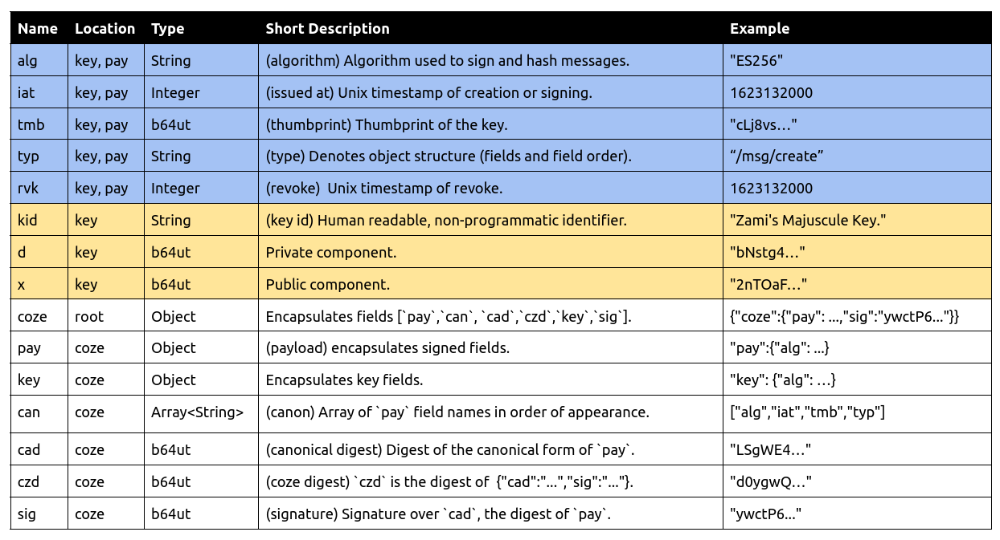

# ⚠️ COZE IS IN PRE-ALPHA AND HAS SECURITY CONCERNS.  USE AT YOUR OWN RISK ⚠️
[](https://pkg.go.dev/github.com/cyphrme/coze)


[Presentation](https://docs.google.com/presentation/d/1bVojfkDs7K9hRwjr8zMW-AoHv5yAZjKL9Z3Bicz5Too)

# Coze 
Coze is a cryptographic JSON messaging specification designed for human
readability.

Play with Coze here: https://cyphr.me/coze_verifier


## Example Coze
```JSON
{
	"pay": {
		"msg": "Coze Rocks",
		"alg": "ES256",
		"iat": 1627518000,
		"tmb": "cLj8vsYtMBwYkzoFVZHBZo6SNL8wSdCIjCKAwXNuhOk",
		"typ": "cyphr.me/msg"
	},
	"sig": "ywctP6lEQ_HcYLhgpoecqhFrqNpBSyNPuAPOV94SThuztJek7x7H9mXFD0xTrlmQPg_WC7jwg70nzNoGn70JyA"
}
```

# Coze Design Goals
1. Valid and idiomatic JSON. 
2. Human readable and writable.
3. Small in scope.
4. Cryptographic agility.


# Coze Reserved Names
Coze objects encapsulate a set of JSON name/value pairs.  Coze reserved names
are short, unique, and unlikely to require namespacing by applications.
Applications are permitted to use any name except reserved names. The Coze
objects `pay`, `key`, and `coze` have respective reserved names.  




# Pay
`pay` may contain the standard fields `alg`, `iat`, `tmb`, and `typ` as
well as custom fields.  In the first example, `msg` is a custom field.

## `head` Reserved Names
- `alg`  Specific signing algorithm.  E.g. `"ES256"`
- `iat`  The time when the message was signed. E.g. `1623132000`
- `tmb`  Thumbprint of the key used to sign the message.  E.g. `"0148F4..."`
- `typ`  Type of `head`. `typ` may denote the canon of `head`. E.g.
           `"cyphr.me/msg/create"` denotes the canon `["alg","iat","msg","tmb",
           "typ"]`


# Coze Key
## Example Public Coze Key
```JSON
{
	"alg":"ES256",
	"iat":1623132000,
	"kid":"Zami's Majuscule Key.",
	"tmb":"cLj8vsYtMBwYkzoFVZHBZo6SNL8wSdCIjCKAwXNuhOk",
	"x":"2nTOaFVm2QLxmUO_SjgyscVHBtvHEfo2rq65MvgNRjORojq39Haq9rXNxvXxwba_Xj0F5vZibJR3isBdOWbo5g"
}
```

## Example Private Coze Key
```JSON
{
	"alg":"ES256",
	"iat":1623132000,
	"kid":"Zami's Majuscule Key.",
	"d":"bNstg4_H3m3SlROufwRSEgibLrBuRq9114OvdapcpVA",
	"tmb":"cLj8vsYtMBwYkzoFVZHBZo6SNL8wSdCIjCKAwXNuhOk",
	"x":"2nTOaFVm2QLxmUO_SjgyscVHBtvHEfo2rq65MvgNRjORojq39Haq9rXNxvXxwba_Xj0F5vZibJR3isBdOWbo5g"
}`
```

## Coze Key Reserved Names
Coze keys require `alg`, `iat`, `tmb`, and the public components according
to `alg`.  

- `key`  (Object) Key object. E.g. `"key":{"alg":"ES256", ...}`
- `alg`  (Required) Signing algorithm.  E.g. `"ES256"`
- `d`    (Private Key Required) Private component.  E.g. `"bNstg4..."`
- `iat`  (Required) "Issued at"  When the key was created. E.g. `1623132000`
- `kid`  (Recommended) Human readable, non-programmatic identifier for the key.
            E.g. `"kid":"My Cyphr.me Key"`. 
- `tmb`  (Required) Thumbprint of the key.  E.g. `"cLj8vs..."`
- `x`    (Key Required) X concatenated with Y for EdDSA.  E.g. `"2nTOaF..."`.
- `typ`  (Optional) Optional type for application specific fields.  
- `rvk`  (Optional) Time of key revocation.  See the `rvk` section.  

Note that `kid` must not be used programmatically.

Note that the private component `d` is not included in `tmb` generation.  `tmb`
is generated from `alg`'s thumbprint canon fields and not `typ`. For example,
the algorithm `ES256` uses a thumbprint canon of `["alg", "x", "y"]` and a
hashing algorithm of `SHA-256`. See the thumbprint section for more.

Encoded values use base64 with the URI safe alphabet and padding omitted.

# Canon
Coze JSON objects are canonicalized and hashed for creating digests, signing,
and verification. 

For JSON objects the canonical digest is generated by hashing the canonical
form.  For binary files the canonical digest is simply the digest of the file.

The hashing algorithm is specified by `alg`.  For example, the hashing algorithm
denoted by `"ES256"` is `"SHA-256"`.

## Canon for JSON 
The three steps in generating the canonical form of a JSON object:
 0. Order by canon and do not include fields excluded from canon.
 2. Remove insignificant whitespace and serialize.

The canonical digest of JSON objects is generated by hashing the canonical form.
The canonical digest of `head` is `cad` and the canonical digest of `key` is
`tmb`.  

The canon for thumbprints is derived from `alg`. For example, the canon derived
from `"ES256"` is `["alg","x","y"]`.

`head`'s canon may be inferred by present fields (default), implicitly known by
applications, implicitly derived by "typ" in "head", or explicitly specified by
`can`.  Applications should specify canon expectations in API documentation.  If
a message is malformed the application must error. 

In the first example the `cad`  is
`53BAC7F262C56FF7B6CEF1BCF0D0A3AEB7E668C08D3B13AE161F7F34EDC6F33B`

`cyd` is generated from the canonical form of `coze` with the canon
["cad","sig"] which results in the JSON `{"cad":"...",sig:"..."}`. `cyd` refers
to a particular signed message. `cyd`'s hash must align with `alg` in `head`. 

In the first example, the `cyd` is
`20C57D022AE2DD53D18189B490E504DF52B7CEBEB4B5BC954D475ACE5FDC083E`

Applications may ignore `can` in `coze` and under typical use it is recommended
that `can` be omitted.  


### Key Thumbprints
The key thumbprint, `tmb`, is the canonical digest of a key.  Coze defines a
canon for each `alg`. 

The first example key has an `alg` of `ES256`, which has the canon
["alg","x","y"].  Using this canon, the canonical form of the key above is:

```JSON
{"alg":"ES256","x":"DA74CE685566D902F19943BF4A3832B1C54706DBC711FA36AEAEB932F80D4633","y":"91A23AB7F476AAF6B5CDC6F5F1C1B6BF5E3D05E6F6626C94778AC05D3966E8E6"}
```

Hashing results in the digest value of `0148F4CD9093C9CBE3E8BF78D3E6C9B824F11DD2F29E2B1A630DD1CE1E176CDD` for `tmb`.

### Coze Key thumbprint canon:
For Coze keys, the following canons are defined:

- ECDSA (ES256, ES384, ES512): ["alg","x","y"]
- EdDSA (Ed25519):             ["alg","x"]


### Canon for Binaries
The canonical digest of a binary file is simply the digest of the
file using the hash specified by `alg`. For example, an image
("Hello_World!.gif") may be referred to in a JSON object by its digest.

```JSON
{
	"alg":"SHA-256",
	"file_name":"Hello_World!.gif",
	"image":"F4A7C3119905835B546D9EC13A84B9CFDD04D1DD31B82A18D44A7F2CDCBE29E4"
}
```

As a further example, including a file's digest in a signed message, denoted by
`id`, may represent the authorization to upload a file to a user's account:

```JSON
{
	"head": {
		"alg": "ES256",
		"ext": "gif",
		"file_name": "Hello_World!.gif",
		"iat": 1623132000,
		"id": "F4A7C3119905835B546D9EC13A84B9CFDD04D1DD31B82A18D44A7F2CDCBE29E4",
		"tmb": "0148F4CD9093C9CBE3E8BF78D3E6C9B824F11DD2F29E2B1A630DD1CE1E176CDD",
		"typ": "cyphr.me/file/create"
	},
	"sig": "C7687E818AFBC7E175AD273B51AE21F54D3DD8CF4752795E9CC357B1425B76A2E986AD77AD2801666C41313AC7CF7FBC634566C2AF4892CA69430C8538CD5BB6"
}
```
 

# Wrapped Coze
The JSON name `coze` is used to wrap Coze objects.  For example:

```JSON
{
	"coze":{
			"head": {
			"alg": "ES256",
			"iat": 1623132000,
			"msg": "Coze Rocks",
			"tmb": "0148F4CD9093C9CBE3E8BF78D3E6C9B824F11DD2F29E2B1A630DD1CE1E176CDD",
			"typ": "cyphr.me/msg/create"
	},
		"sig": "E848D97CA3A1BAE8C1AE6ACBAE1E73B7C23C9A74581003CAEB4FCBA4EF39EC8B07996B4F52F5D5925C48A793C54495A3B89DD9A8B55D29E72B8B9DF599E0A734"
	}
}
```

We recommend against needlessly wrapping implicit Coze objects with `coze`. For
example, the JSON object `{"head":{...},"sig":...}` doesn't need the labeled
`coze` if already implicitly known.


## `coze` reserved names

- `coze` JSON label for a Coze object.  E.g. `{"coze":{"head":..., sig:...}}`
- `can`  Canon for hashing over `head`.  E.g. `["alg","iat","tmb","typ"]`
- `cad`  Canon digest.  The digest of `head`.  E.g.: `"24F11D..."`
- `cyd`  Cy digest, the digest over `["cad","sig"]`. `cyd`'s hash must align
  with `alg` in `head`.  
- `head` Label for the head object.  E.g. `"head":{"alg":...}`
- `sig`  Signature over the bytes of `cad`, and `sig` does not rehash `cad`
  before signing.  E.g. `"sig":"CC3AD6..."`

Like `cad`, `cyd` is calculated from brace to brace, including the braces.  

`cad` and `cyd` are recalculatable and are recommended to be omitted, although
they may be useful for reference.  

## Example full `coze` with `head`, `key`, `can`, `cad`, `cyd`, and `sig`.  
The following expands the first example and is largely redundant. `key` may be
looked up based on `tmb`. `can`, `cad`, and `cyd` are recalculatable and
generally should be omitted.  The label `coze` may be inferred. Because of these
redundancies, it is suggested that simple Coze objects are used where possible.
The following form may be useful when referring to specific parts.  

```JSON
{
	"coze": {
		"pay": {
			"alg": "ES256",
			"iat": 1623132000,
			"msg": "Coze Rocks",
			"tmb": "0148F4CD9093C9CBE3E8BF78D3E6C9B824F11DD2F29E2B1A630DD1CE1E176CDD",
			"typ": "cyphr.me/msg/create"
		},
		"key": {
			"alg": "ES256",
			"iat": 1623132000,
			"tmb": "0148F4CD9093C9CBE3E8BF78D3E6C9B824F11DD2F29E2B1A630DD1CE1E176CDD",
			"x": "DA74CE685566D902F19943BF4A3832B1C54706DBC711FA36AEAEB932F80D4633",
			"y": "91A23AB7F476AAF6B5CDC6F5F1C1B6BF5E3D05E6F6626C94778AC05D3966E8E6"
		},
		"can": ["alg","iat","msg","tmb","typ"],
		"cad": "53BAC7F262C56FF7B6CEF1BCF0D0A3AEB7E668C08D3B13AE161F7F34EDC6F33B",
		"cyd": "20C57D022AE2DD53D18189B490E504DF52B7CEBEB4B5BC954D475ACE5FDC083E",
		"sig": "E848D97CA3A1BAE8C1AE6ACBAE1E73B7C23C9A74581003CAEB4FCBA4EF39EC8B07996B4F52F5D5925C48A793C54495A3B89DD9A8B55D29E72B8B9DF599E0A734"
	}
}
```

Simplifies to:

```JSON
{
	"head": {
		"alg": "ES256",
		"iat": 1623132000,
		"msg": "Coze Rocks",
		"tmb": "0148F4CD9093C9CBE3E8BF78D3E6C9B824F11DD2F29E2B1A630DD1CE1E176CDD",
		"typ": "cyphr.me/msg/create"
	},
	"sig": "E848D97CA3A1BAE8C1AE6ACBAE1E73B7C23C9A74581003CAEB4FCBA4EF39EC8B07996B4F52F5D5925C48A793C54495A3B89DD9A8B55D29E72B8B9DF599E0A734"
}
```

# Revoke
A Coze key is self-revoked by signing a self-revoke message.  A self-revoke
message has the field `rvk` with an integer value greater than `0`. The value of
`rvk` is a Unix timestamp.

## Example Self Revoke

```JSON
{
	"head": {
		"alg": "ES256",
		"iat": 1623132000,
		"msg": "Test revoke key.",
		"rvk": 1623132000,
		"tmb": "0148F4CD9093C9CBE3E8BF78D3E6C9B824F11DD2F29E2B1A630DD1CE1E176CDD",
		"typ": "cyphr.me/key/revoke"
	},
	"sig": "FD304BFA877E3B14686BC3BC74E0BAC765A3A0B4A1B2211A54833957DA97AFC2D9CC1592ADC53AD9D9FB8AED9C83676BAB16FD19378CAA203564797FF50F6759"
}
```

- `rvk` - Unix timestamp of when the key was revoked.  

Coze explicitly defines a self-revoke method so that third parties may revoke
leaked keys. Systems storing Coze keys should mark key as revoked when given a
self-revoke message.  Systems may use any non-zero value for `rvk` to denote key
revocation and the integer value "1" is suitable to denote revocation.

Key expiration policies, such as key rotation, are outside the scope of Coze.
Self revokes with future times must immediately be considered as revoked.  

# Supported Algorithms 
- ES224
- ES256
- ES384
- ES512
- Ed25519 // TODO

## `alg` parameters:

"alg":"ES256"
- Genus: ESCDSA
- Family: EC
- Use: sig
- Sig.Size: 512
- Curve: P-256
- Hash: SHA-256
- Hash.Size:256 

# Coze Constraints
- JSON objects must be valid.
- JSON field names are always strings (which is standard JSON.)
- JSON field names and values are case sensitive.
- UTF-8 encoded and Unicode sorted.  


# Gotchas
Edge cases and non-obvious things.

## `cyd` is the digest over `{"cad":"...","sig":"..."}`
One may expect `cyd` to be the digest of `cad` || `sig`, or ever the
digest of `coze`. Like `cad`, `cyd` is the digest of JSON with a defined canon
`["cad","sig"]`.

## ECDSA has just `x` and not `x` and `y`
This normalizes ECDSA with EdDSA, which has just `x`.  Although the industry
standard for ECDSA denotes `x` and `y` separately, putting all public components
in `x` and all private components in d makes it clearer which parts are public
and private.  

## ECDSA Signature Bytes
For ECDSA, the signature is the concatenated, and if needed padded, bytes of R
and S.  For ES512 padding is needed because P-521 is prime, and is rounded up to
the nearest byte before concatenation.  

## tmb's canon is denoted by `alg` and not `typ`.
For signed objects `typ` is used to denote the canon.  For example, a `typ` with
value `cyphr.me/create/msg` has a canon of ["alg", "iat", "msg", "tmb", "typ"],
as defined by the service.  

For keys `tmb` is generated by the canon specified by `alg` and not `typ`. `typ`
is ignored for `tmb` generation. Like `typ` in `head`, in `key` `typ` may be
used to specify custom application fields, e.g. "first_seen".  

## Javascript Vs Golang Crypto.
Javascript's `SubtleCrypto.sign(algorithm, key, data)` always hashes a message
before signing while Go's ECDSA expects a digest to sign. This means that in
Javascript messages must be passed for signing, while in Go only a digest is
needed.  


# Coze Verifier
Cyphr.me has an online tool to sign and verify messages.  We hope in the near
future to release an open source, stand alone version of the webpage.  

Play with Coze here: https://cyphr.me/coze_verifier.


# Other Coze Related Projects
See also [Coze js](https://github.com/Cyphrme/cozejs).


# FAQ

## Pronunciation?
We say "Co-zee" like a comfy cozy couch.  The English word Coze is pronounced
"kohz".  


## What does "Coze" mean? 
The English word "coze" means "a friendly talk; a chat." which is the perfect
name of a messaging standard. 

Jared suggested Coze because it looks like JOSE or COSE but it's funnier. 


## "Coze" vs "coze"?
We use upper case "Coze" to refer to the specification, and "coze" to refer to
coze messages and objects.  


## Why release pre-alpha on 2021/06/08?
Coze was released on 2021/06/08 (1623132000) since it's 30 years and one day
after the initial release of PGP 1.0.  


## Fields are Unicode sorted?
Yes.  Unicode is a superset of ASCII and UTF-8 shares sorting order with
Unicode.  This results in broad, out of the box compatibility.

UTF-16 (Javascript) has some code points out of order. For these systems, a
small amount of additional logic is needed to correct the sort order.  


## Zero case
If `alg` and `tmb` are know by the application, a zero case is legitimate.  
```json
{
 "head": {},
 "sig": "TODOSIGHERE"
}
```
// TODO correct sig with key above.  

## Binary?
No.


## Why not use binary payloads like JOSE?
Coze is designed for JSON. JSON is not designed for binary but is designed for
human readable fields.  Coze uses digests, of both arbitrary binary files and
cryptographic hashes, which is an acceptable compromise.  

A binary file's digest is easily included in a coze, while the binary itself
should be transported outside of the coze. 

For example,  the digest of an image may be included in a coze.  The field `id`
below is the digest of an image. The coze includes other metadata.  

```JSON
{
 "head": {
  "alg": "ES256",
  "ext": "png",
  "iat": 1623132000,
  "id": "D0AA358048454A7C564C42F8D066F0932A3985AAC3F71FF59A1BCD1372E58590",
  "parent": "96087E8C42DABC25EA5E33FDD4EFED4289F31F4B4826114088527E1F9A735647",
  "tmb": "0148F4CD9093C9CBE3E8BF78D3E6C9B824F11DD2F29E2B1A630DD1CE1E176CDD",
  "typ": "cyphr.me/ac/image/create"
 },
 "sig": "3456AB9532BDC0D9551ECF4D7D109EFA810921C5EB65A3912FD9988A58B3D14066326C7739778D787690BD8A7B88864DFA229A550DC9F39F7FD2729B2F4ED981"
}
```


## Is Coze versioned?  
Our hope is Coze stays simple and stable enough to preclude versioning.  `alg`
refers to a specific set of parameters.  If a parameter needs changing, like the
hashing algorithm, `alg` would reflect that change.  


## How do I do versioning?
Use `typ` for API versioning, e.g. `cyphr.me/v1/msg`.


## Why `head` and not `pay`, `payload`, or `body`?
`head` explicitly denotes the inclusion of cryptographic components.

Also, excluding digests, Coze explicitly recommends against including binaries
in JSON messages. A minor concern was that "payload"/"pay" may denote including
arbitrary binary values.


## `head` has `alg` and other stuff in it. Why are cryptographic components mixed?
Coze's `head` includes all payload information, a design we've dubbed a "fat
head".  We consider single pass hashing critical for Coze's simple design as it
is human friendly, requires less complexity, and alternatives provide low
additional value.

Verifying a signed raw message already requires hashing `head`.  Parsing `alg`
from `head` is a small additional cost.  

Alternative schemes require a larger canon, `{"head":{...},"pay":{...}}`, or
concatenation like `digest(head) || digest(pay)`.  By hashing only `head`, the
"pay" label and encapsulating parenthathese are dropped: `head:{...}` and the
label `"head"` may then be inferred, `{...}`.  `{...}` is better than
`{"head":{...},"pay":{...}}`.  

We do not foresee prudence in optimizing for long messages. If early knowledge
of Coze standard fields is critical for application performance, we suggest
encapsulating all non-standard fields in "~", the last ASCII character.  We've
dubbed this a "tilde encapsulated payload". For example: 

```json
{
  "alg": "ES256",
  "iat": 1623132000,
  "tmb": "0148F4CD9093C9CBE3E8BF78D3E6C9B824F11DD2F29E2B1A630DD1CE1E176CDD",
  "typ": "cyphr.me/msg/create",
  "~": {
   "msg": "tilde encapsulated payload"
  }
 }
 ```

## Why not PGP/OpenSSL/LibreSSL/libsodium/JOSE/COSE/etc...?
We have a lot of respect for existing projects. They're great at what they do.
Existing solutions were not meeting our particular needs. Coze is influenced
by many ideas and standards.  
 
See the `coze_vs_jose.md` document for more. 


## Does Coze have checksums?
For keys, the field `tmb` can the function of a checksum as it is the digest
over `alg` and the key's public components (such as `x` and `y`).  When given a
new public key, systems storing keys can recalculate `tmb`, compare the given
value, and error if values do not match. Alternatively, systems can verify a
signed message with the key.

For messages, `cad` or cryptographic verification may serve the function of
checksums.  


## Why is Coze's scope so limited?
Coze is intentionally scope limited.  It is easier to extend a limited standard
than to fix a large standard. Coze can be extended and customized for individual
applications. 


## Where does the cryptography come from?
Much of this comes from NIST FIPS (See https://csrc.nist.gov/publications/fips)

For example, FIPS PUB 186-3 defines P-224, P-256, P-384, and P-521.


# Unsupported Things?
The following are out of scope or redundant.  

- `ES192`, `P-192` - Not implemented anywhere and dropped from later FIPS.
- `SHA1`, `MD5` - Not considered secure for a long time.
- `kty` - "Key type". Redundant by `alg`. 
- `iss` - `tmb` fulfills this role.  Systems that need something like an issuer,
associating messages with people/systems, can look up "issuer" based on
thumbprint.  Associating thumbprints to issuers is the design we recommend.  
- `exp` - "Expiration". Outside the scope of Coze.  
- `nbf` - "Not before". Outside the scope of Coze.  
- `aud` - "Audience". Outside the scope of Coze, but consider denoting this with
  'typ'.
- `sub` - "Subject". Outside the scope of Coze, but consider denoting this with
  'typ'.
- `jti` - "Token ID/JWT ID". Redundant by `cyd`, `cad`, or an application
  specified field.


## Who created Coze?
Coze was created by Cyphr.me.  


## Discussion
https://old.reddit.com/r/CozeJson


## Other Resources
Coze Table links: 
https://docs.google.com/document/d/15_1R7qwfCf-Y3rTamtYS_QXuoTSNrOwbIRopwmv4KOc


## Cyphr.me Online Coze Verifier
https://cyphr.me/coze_verifier


----------------------------------------------------------------------
# Attribution, Trademark notice, and License
Coze is released under The 3-Clause BSD License. 

"Cyphr.me" is a trademark of Cypherpunk, LLC. The Cyphr.me logo is all rights
reserved Cypherpunk, LLC and may not be used without permission.